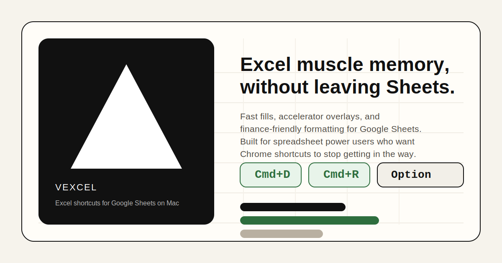

# Vexcel

  

  <strong>Excel-style keyboard shortcuts for Google Sheets on macOS.</strong> 
  Built for people who live in spreadsheets and do not want Chrome or Sheets fighting their hands.

## What Vexcel Does

Vexcel is a Manifest V3 Chrome extension that remaps Google Sheets around fast Excel-like workflows. It intercepts keystrokes before Sheets or Chrome can steal them, drives the Sheets UI when needed, and adds a lightweight accelerator system for power users who want ribbon-style access without touching the mouse.

The repo is especially focused on:

- fast fill behavior for `Cmd+D` and `Cmd+R`
- browser-conflicting shortcut overrides that are actually usable
- finance-friendly format and color cycles
- an `Option`-triggered accelerator overlay for high-speed actions
- lightweight local debug/perf tooling for hardening flaky Sheets behavior

## Highlights

- `Cmd+D` fill down, including Excel-style single-cell behavior from the cell above
- `Cmd+R` fill right, including Excel-style single-cell behavior from the cell to the left
- `Ctrl+Option+F` format cycle for common spreadsheet formats
- `Ctrl+Option+C` font color cycle
- `Ctrl+Option+A` auto-color selection for hardcodes, formulas, and cross-sheet formulas
- `Option` accelerator overlay for menu-like command access
- popup controls for enable/disable, debug mode, and opt-in browser overrides

## Install

1. Clone or download this repo.
2. Open `chrome://extensions`.
3. Turn on **Developer mode**.
4. Click **Load unpacked**.
5. Select this folder: `Vexcel`.
6. Open Google Sheets and start using the shortcuts.

## Direct Codex <> Google Sheets Workflow

This repo now includes a direct Google Sheets bridge so Codex can edit live Sheets ranges without exporting `.xlsx` files back and forth.

Use it for workflows like:

- read formulas from a live Google Sheet into Codex
- update a model range in place with `USER_ENTERED` formulas
- append raw data rows directly to a sheet
- clear or rewrite scratch tabs without download/upload loops

Core files:

- `./scripts/gsheets`
- `./scripts/gsheets_cli.py`
- `./scripts/requirements-gsheets.txt`
- `./about/codex-google-sheets.md`

Typical setup:

1. Install the Python dependencies in a repo venv.
2. Configure either a service account or an OAuth desktop client.
3. Run `./scripts/gsheets auth` once if you are using OAuth.
4. Add friendly spreadsheet aliases in `vexcel-sheets.json`.

Then Codex can work directly against a live spreadsheet instead of round-tripping through local files.

There is also a popup-driven sync flow for workbook iteration:

1. generate or update an `.xlsx` locally
2. copy its path to the clipboard with `./scripts/copy-path ...`
3. start `./scripts/gsheets-sync-server`
4. open the destination tab in Google Sheets
5. press **Sync Active Sheet From Clipboard** in the Vexcel popup

That replaces the active Google Sheets tab with the workbook sheet data without making you manually export, upload, and re-import every iteration.

## Recommended Workflows

### Fill Faster

- Select a range and press `Cmd+D` to fill downward from the top row.
- Select a range and press `Cmd+R` to fill rightward from the leftmost column.
- Select a single cell and press:
  - `Cmd+D` to pull from the cell above
  - `Cmd+R` to pull from the cell on the left

### Stay in the Grid

- Tap `Option` to open the accelerator overlay.
- Use shortcut overrides for actions Chrome normally steals.
- Use format and color cycles for fast model cleanup without hunting through menus.

### Debug Hard Cases

- Turn on **Debug Mode** in the popup to see rolling command timings.
- Use the built-in perf summaries to spot slow Sheets flows quickly.

## Project Map

- [`about/README.md`](./about/README.md): package overview
- [`about/architecture.md`](./about/architecture.md): runtime and execution model
- [`about/shortcuts.md`](./about/shortcuts.md): shortcut inventory
- [`about/file-map.md`](./about/file-map.md): folder-by-folder guide
- [`about/codex-google-sheets.md`](./about/codex-google-sheets.md): direct Codex-to-Sheets bridge

## Tech Notes

- Chrome Extension Manifest V3
- Injected into Google Sheets at `document_start`
- Works across top-frame UI plus iframe-based grid editing
- Uses a mix of direct DOM control, tool-finder automation, toolbar actions, and targeted fallbacks where Sheets is inconsistent

## Status

Vexcel is actively tuned for real spreadsheet use, especially finance-heavy workflows where latency and shortcut fidelity matter. The codebase is optimized for day-to-day use in Google Sheets on Mac, and the sharp edges are mostly around whatever DOM changes Google ships next.
